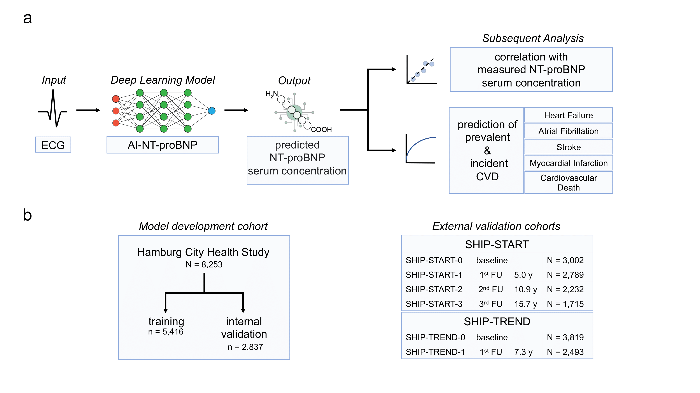

# Deep learning-based NT-proBNP prediction from the ECG with high diagnostic value for prevalent cardiovascular disease and adverse outcomes in the community


<br /><br />Official implementation of [Deep learning-based NT-proBNP prediction from the ECG with high diagnostic value for prevalent cardiovascular disease and adverse outcomes in the community](https://github.com/jpbremer/AI-NT-proBNP), a deep learning based approach to predicting NT-proBNP serum levels from 12-channel resting ECGs.

AI-NT-proBNP showed high predictive value for prevalent and incident cardiovascular disease.


## Requirements

A standard computer with enough RAM is required for inference. For training, a GPU with > 10 GB VRAM is recommended. The algorithm was developed on a Nvidia A6000. The algorithm can also be run on CPU by setting device to "cpu" in the config.py file. 

## Installation
```sh
# install pytorch
conda install pytorch torchvision torchaudio cudatoolkit=11.3 -c pytorch
```
```sh
# clone repo
$ git clone https://github.com/jpbremer/AI-NT-proBNP
```
```sh
# install requirements
$ cd AI-NT-proBNP
$ pip install -r requirements.txt
```

## Inference

1. Download [weights](https://drive.google.com/file/d/1dT4N-2PQzp2UxWpuGLZgzkPnys0FKCKI/view?usp=sharing) and put them in the `weights/proBNP/` folder.
 
2. Run inference. 
   ```sh
   $ python main.py inference
   ```

The config file is currently setup to be run on the example data provided in `/sample_data/`.

###
###  Running inference on your own data
A dataframe in the following format is required.
   ```sh
            ecg_path                   num_samples     split      proBNP    fold   
      1     ./sample_data/ecg01.h5     5000            test       5.5       0
      2     ./sample_data/ecg02.h5     5000            test       3.3       0
      3     ./sample_data/ecg03.h5     5000            test       1.6       0
   ```
- <b>ecg_path</b>: path to ecg in h5 format
- <b>num_samples</b>: number of samples in 10 second ECG
- <b>split</b>: one of train, test
- <b>fold</b>: categorical value representing the designated fold for each ecg, here we used 5
- <b>proBNP</b>: log transformed NT-proBNP levels


## Train
### Training on sample data
A dataframe in the following format is required.
   ```sh
            ecg_path                   num_samples     split      proBNP    fold   
      1     ./sample_data/ecg01.h5     5000            train      5.5       0
      2     ./sample_data/ecg02.h5     5000            train      3.3       1
      3     ./sample_data/ecg03.h5     5000            train      1.6       2
      4     ./sample_data/ecg04.h5     5000            train      2.3       3
      5     ./sample_data/ecg05.h5     5000            train      2.8       4
   ```
- <b>ecg_path</b>: path to ecg in h5 format
- <b>num_samples</b>: number of samples in 10 second ECG
- <b>split</b>: one of train, test
- <b>fold</b>: categorical value representing the designated fold for each ecg, here we used 5
- <b>proBNP</b>: log transformed NT-proBNP levels

Run training. 
   ```sh
   $ python main.py train
   ```